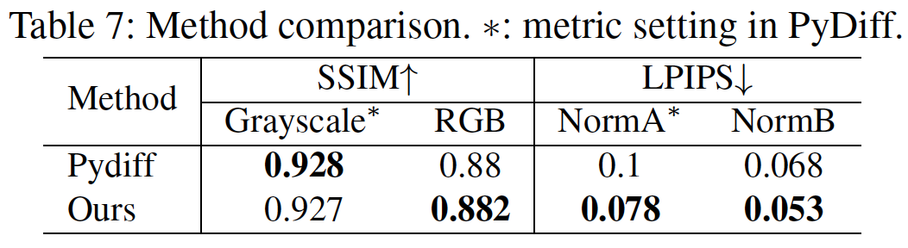
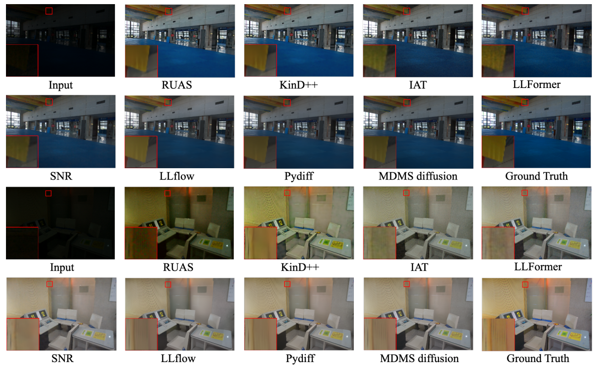
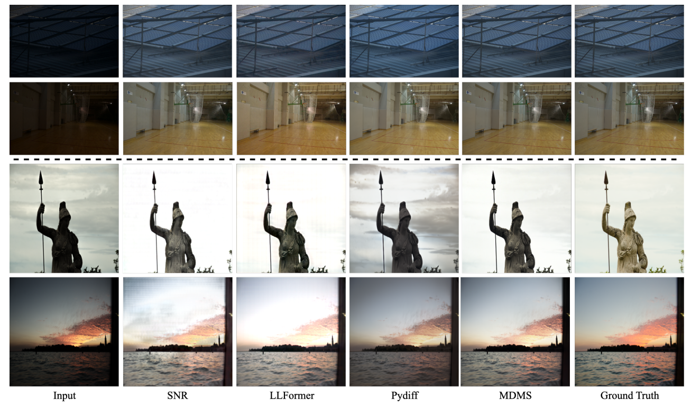
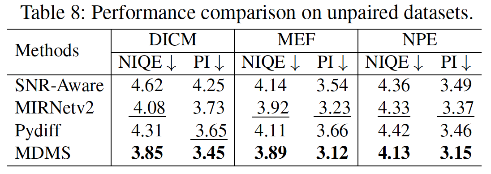

<div align="center">
  
# 【AAAI'2024】Multi-Domain Multi-Scale Diffusion Model for Low-Light Image Enhancement
</div>

The official implementation of AAAI24 paper [Multi-Domain Multi-Scale Diffusion Model for Low-Light Image Enhancement](https://ojs.aaai.org/index.php/AAAI/article/view/28273).

## Environment
create a new conda env,
and run
```
$ pip install -r requirements.txt
```
torch/torchvision with CUDA version >= 11.3 should be fine.

## Demo
#### 1. Download pretrained model

Download the Pretrained MDMS model from [Baidu NetDisk](https://pan.baidu.com/s/1O8hOVflnLGLSLP07nXp_sg?pwd=zftu) or [Google Drive](https://drive.google.com/file/d/1RcYn6543x0TtrKwGGJMnk6Jf48qoh1TC/view?usp=sharing).

Put the downloaded ckpt in `datasets/scratch/LLIE/ckpts`.


#### 2. Inference
```
# in {path_to_this_repo}/,
$ python eval_diffusion.py
```
Put the test input in `datasets/scratch/LLIE/data/lowlight/test/input`.

Output results will be saved in `results/images/lowlight/lowlight`.

## Evaluation

Put the test GT in `datasets/scratch/LLIE/data/lowlight/test/gt` for paired evaluation.

```
# in {path_to_this_repo}/,
$ python evaluation.py
```
* Note that our [evaluation metrics](https://github.com/Oliiveralien/MDMS/tree/main/evaluation.py) are slightly different from [PyDiff](https://github.com/limuloo/PyDIff/tree/862f8cc428450ef02822fd218b15705e2214ec2d/BasicSR-light/basicsr/metrics) (inherited from [BasicSR](https://github.com/XPixelGroup/BasicSR)).

## Results
All results listed in our paper including the compared methods are available in [Baidu Netdisk](https://pan.baidu.com/s/1O8hOVflnLGLSLP07nXp_sg?pwd=zftu) or [Google Drive](https://drive.google.com/file/d/1k9-vD-I5JaHj7Y9bGq1gen2TKEzEhCzs/view?usp=sharing).

* Note that the provided model is trained on the [LOLv1](https://daooshee.github.io/BMVC2018website/) training set, but generalizes well on other datasets.
* For SSIM, we directly calculate the performance on [RGB channel](https://github.com/Oli-iver/MDMS/blob/main/evaluation.py#L49-L51) rather than just [grayscale images](https://github.com/limuloo/PyDIff/blob/862f8cc428450ef02822fd218b15705e2214ec2d/BasicSR-light/basicsr/metrics/ssim_lol.py#L7C1-L12C132) in PyDiff.
* For LPIPS, we use a different normalization method ([NormA](https://github.com/Oliiveralien/MDMS/tree/main/evaluation.py#L74)) compared to PyDiff ([NormB](https://github.com/limuloo/PyDIff/blob/862f8cc428450ef02822fd218b15705e2214ec2d/BasicSR-light/basicsr/metrics/lpips_lol.py#L19)).

Our method remains superior under the same setting as PyDiff.

<div align="center">
  
</div>

### 1. Test results on LOLv1 test set.

<div align="center">
  
</div>

### 2. Generalization results on LOLv2 syn and real test sets.

<div align="center">
  
</div>

### 3. Generalization results on other unpaired datasets.

<div align="center">
  
</div>

We will perform more training and tests on other datasets in the future.

## Training
Put the training dataset in `datasets/scratch/LLIE/data/lowlight/train`.

```
# in {path_to_this_repo}/,
$ python train_diffusion.py
```

Detailed training instructions will be updated soon.

## Citation
If you find this paper useful, please consider staring this repo and citing our paper:
```
@inproceedings{shang2024multi,
  title={Multi-Domain Multi-Scale Diffusion Model for Low-Light Image Enhancement},
  author={Shang, Kai and Shao, Mingwen and Wang, Chao and Cheng, Yuanshuo and Wang, Shuigen},
  booktitle={Proceedings of the AAAI Conference on Artificial Intelligence},
  volume={38},
  number={5},
  pages={4722--4730},
  year={2024}
}
